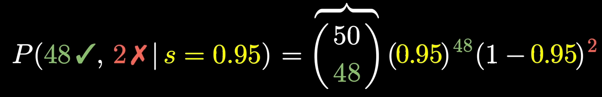

**Binomiale : compter des succès**
La *loi binomiale* $X \sim \mathrm{Bin}(n,p)$ est **discrète** ; elle donne la probabilité d’obtenir exactement $k$ succès lorsque l’on répète **$n$ épreuves de Bernoulli indépendantes** (réussite/échec) dont la probabilité de succès est fixée à $p$ :

$$
\Pr[X=k]=\binom{n}{k} p^{\,k}(1-p)^{\,n-k},\quad k=0,\dots,n.
$$

* **Variable aléatoire :** le *nombre* de succès $k$.
* **Paramètres :** $n$ (nombre d’épreuves) et $p$ (probabilité de succès, *connue et fixe*).
* **Application typique :** « Combien de faces vais-je obtenir en lançant 10 fois une pièce dont la proba de face est 0,6 ? »

---

**Bêta : modéliser l’incertitude sur une probabilité**
La *loi bêta* $\theta \sim \mathrm{Beta}(\alpha,\beta)$ est **continue** sur l’intervalle $[0,1]$. Sa densité est

$$
f(\theta)=\frac{\Gamma(\alpha+\beta)}{\Gamma(\alpha)\,\Gamma(\beta)}\,
          \theta^{\alpha-1}(1-\theta)^{\beta-1},\quad 0<\theta<1.
$$

* **Variable aléatoire :** la *valeur même de la probabilité* $\theta$.
* **Paramètres :** $\alpha,\beta >0$ (souvent interprétés comme un « nombre fictif » de succès et d’échecs).
* **Application typique :** « Quelle est, selon mes données, la distribution plausible pour la proba qu’une pièce tombe sur face ? »

---

### Ce qu’elles « mesurent »

|                      | Binomiale                                 | Bêta                                                                                                                                      |
| -------------------- | ----------------------------------------- | ----------------------------------------------------------------------------------------------------------------------------------------- |
| **Nature**           | Discrète (0 – $n$ succès)                 | Continue (valeurs entre 0 et 1)                                                                                                           |
| **Mesure**           | Fréquence d’un résultat *donné un p fixe* | Incertitude (ou croyance) sur la *valeur inconnue de p*                                                                                   |
| **Vue fréquentiste** | Résultat d’une expérience                 | –                                                                                                                                         |
| **Vue bayésienne**   | *Vraisemblance* des données               | *A priori* / *posteriori* sur p                                                                                                           |
| **Conjugaison**      | –                                         | Conjuguée à la binomiale : après avoir observé $k$ succès sur $n$ essais, $\theta\mid\text{données}\sim\mathrm{Beta}(\alpha+k,\beta+n-k)$ |

---

### Intuition conjointe

1. **On tire la pièce** plusieurs fois → les données $k$ suivent une loi binomiale si l’on suppose $p$ connu.
2. **Mais** si $p$ n’est pas connu, on le traite lui-même comme une variable aléatoire $\theta$ dont l’incertitude est modélisée par une bêta.
3. Cette complémentarité fait de la bêta un « mètre » de notre connaissance sur $p$, alors que la binomiale « compte » les succès *une fois $p$ fixé*.

En résumé : **la binomiale décrit les fluctuations du nombre de succès ; la bêta décrit les fluctuations de la probabilité de succès elle-même.**

# Binomial

[Link to the video](https://www.youtube.com/watch?v=8idr1WZ1A7Q&t=77s)

Voici les **situations concrètes** que Grant Sanderson met en scène tout au long du transcript ; elles servent de fil rouge pour introduire tour à tour la loi binomiale, la loi bêta et la règle de succession de Laplace :

| # | Mise en situation dans la vidéo                                                                                                                                                                                                                            | Notions illustrées                                                                                                                                                                                 | Pourquoi c’est parlant                                                                                                                                                                                               |
| - | ---------------------------------------------------------------------------------------------------------------------------------------------------------------------------------------------------------------------------------------------------------- | -------------------------------------------------------------------------------------------------------------------------------------------------------------------------------------------------- | -------------------------------------------------------------------------------------------------------------------------------------------------------------------------------------------------------------------- |
| 1 | **Trois vendeurs Amazon** qui proposent exactement le même produit mais avec des profils de notes différents : • Vendeur A : ★100 % positifs, **10** avis • Vendeur B : ★96 % positifs, **50** avis • Vendeur C : ★93 % positifs, **200** avis    | – Loi binomiale (succès/échec = “avis positif/négatif”) – Effet de la taille d’échantillon sur la confiance                                                                                     | On ressent immédiatement qu’« 100 % sur 10 avis » n’est pas forcément plus fiable que « 96 % sur 50 ». Cela motive l’idée de comparer des **distributions de probabilité**, pas seulement des moyennes ([Medium][1]) |
| 2 | **Choisir entre deux vendeurs** : • A : 100 % (10/10) • B : 96 % (96/100) → On applique la **règle de succession de Laplace** : on ajoute fictivement 1 bon **et** 1 mauvais avis à chacun : • A → 11 / 12 ≈ 91,7 % • B → 97 / 102 ≈ 95,1 % | – Prior uniforme Beta(1, 1) – Mise à jour Beta(s + 1, n − s + 1) – Estimation ponctuelle (espérance)                                                                                         | Cette “astuce” montre qu’un tout petit échantillon extrêmement positif se fait vite doubler par un échantillon plus large mais légèrement moins flatteur ([Medium][2])                                               |
| 3 | **Pile ou face cachée** : on a lancé une pièce **10 fois** et obtenu **8 faces**.  Quelle est la “vraie” probabilité $p$ de face ?  On passe alors :  – de la loi binomiale $\Pr(k=8\mid p)$ – à la loi bêta $\Pr(p\mid k=8)$ : Beta(9, 3)           | – Posterior Beta(α = s + 1, β = n − s + 1) – Visualisation de la densité pour montrer que les valeurs de $p$ autour de 0,8 sont les plus plausibles, mais qu’il reste une incertitude non nulle | C’est l’exemple « classique » qui fait passer de “compter les succès” (binomiale) à “mesurer notre incertitude sur $p$” (bêta). La règle de succession apparaît comme le cas $s=8, n=10$. ([Wikipedia][3])           |
| 4 | **Heuristique prête-à-l’emploi** proposée en fin de vidéo : *« Ajoutez toujours 1 avis positif et 1 négatif avant de classer des notes »*  (version courte de Laplace).                                                                                    | – Règle pratique dérivée des exemples précédents                                                                                                                                                   | Donne une recette immédiate aux développeurs/analystes qui veulent “trier intelligemment” des produits notés en ligne.                                                                                               |

### En résumé

* **Exemple 1** met en évidence le **problème** : comparer des pourcentages issus de tailles d’échantillon très différentes.
* **Exemple 2** introduit la **solution bayésienne minimaliste** (Laplace) pour corriger ce biais.
* **Exemple 3** élargit la perspective : la loi bêta n’est pas réservée aux avis Amazon ; elle sert chaque fois qu’on veut inférer une **probabilité inconnue** après avoir vu un certain nombre de succès/échecs.
* **Exemple 4** condense tout cela en une règle de pouce facile à réutiliser.

Ces quatre exemples forment la trame pédagogique du transcript ; chacun ouvre la porte à un concept statistique de plus en plus général.

[1]: https://medium.com/born-to-lead/the-probabilities-of-probabilities-binomial-distributions-46e37d908bc8 "The Probabilities Of Probabilities: Binomial Distributions | by Md Ashikquer Rahman | NextGen | Medium"
[2]: https://medium.com/%40kirudang/the-laplaces-rule-of-succession-product-selection-based-on-rating-different-sample-size-590453d74b8a "The Laplace’s Rule of Succession — Product selection based on rating (different sample size). | by Kiel Dang | Medium"
[3]: https://en.wikipedia.org/wiki/Beta_distribution?utm_source=chatgpt.com "Beta distribution"
