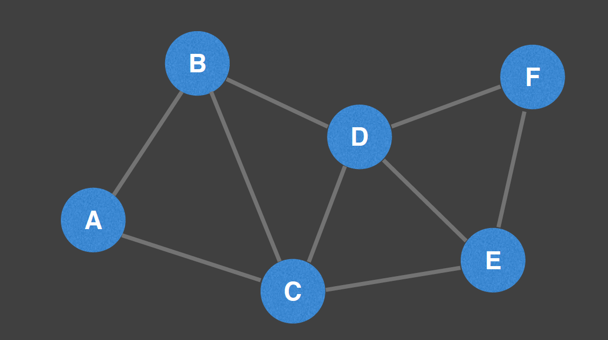
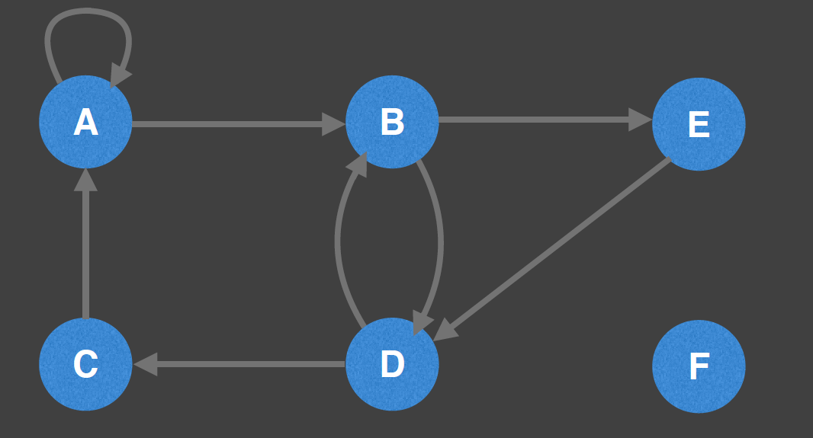
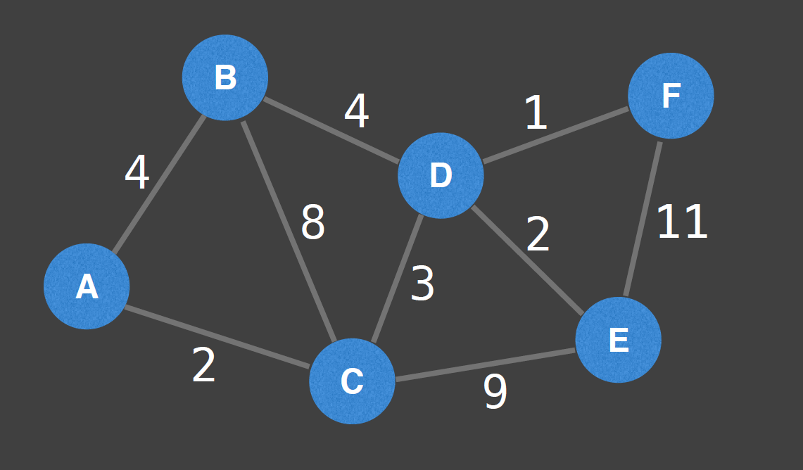
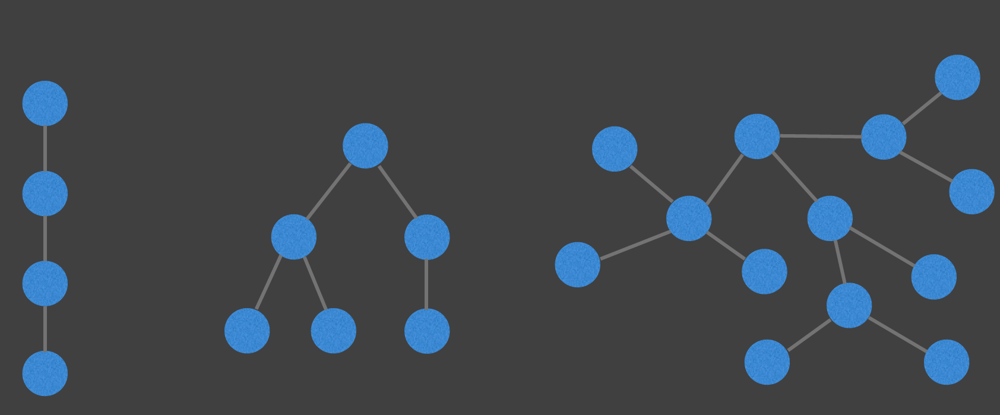
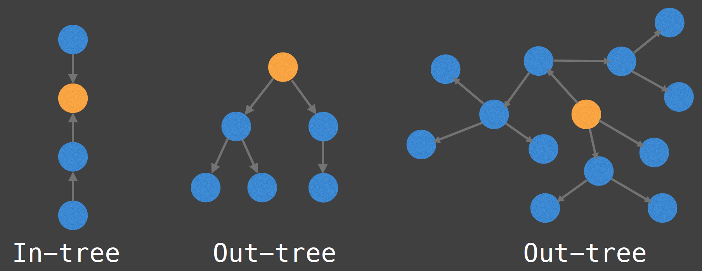
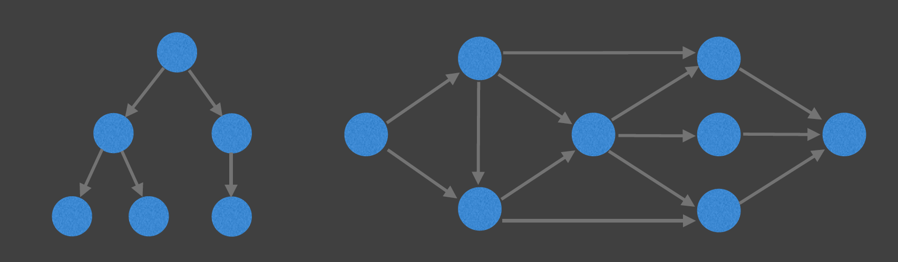
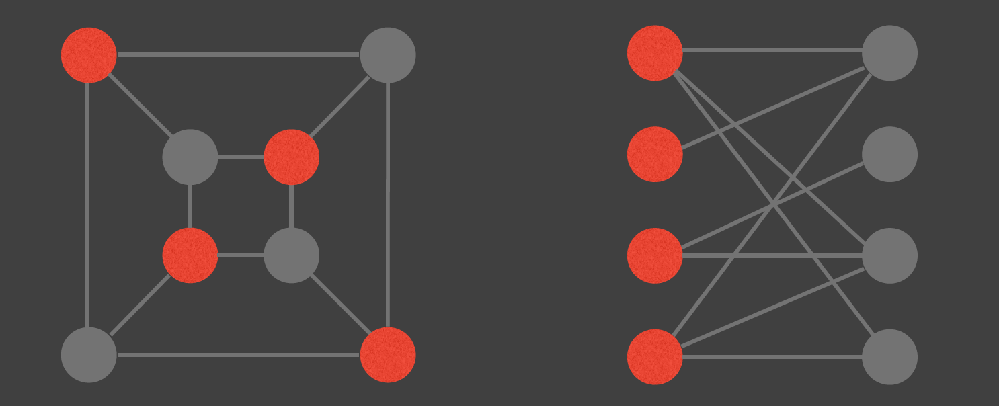
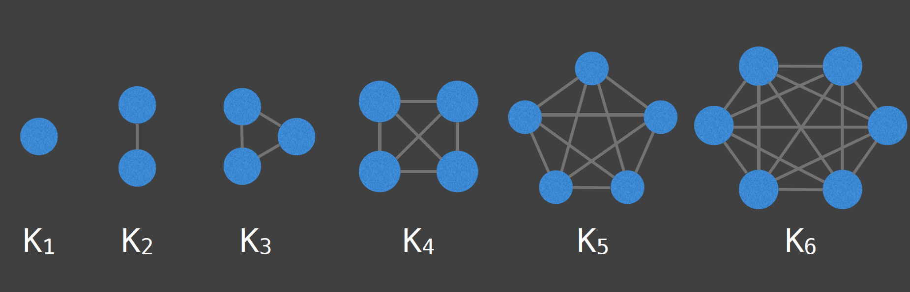

[youtube source](https://www.youtube.com/watch?v=7fujbpJ0LB4&list=PLDV1Zeh2NRsDGO4--qE8yH72HFL1Km93P&index=4)

[github william fiset 1](https://github.com/williamfiset/algorithms#graph-theory)

[github william fiset 1](https://github.com/williamfiset/Algorithms/tree/master/slides/graphtheory)

# Type of graphs

## Undirected Graph
An undirected graph is a graph in which edges have no orientation. The edge (u, v) is identical to the edge (v, u). In the graph below, the nodes could represent cities and an edge could represent a bidirectional road.

## Directed Graph (Digraph)
A directed graph or digraph is a graph in which edges have orientations. For example, the edge (u, v) is the edge from node u to node v.
In the graph below, the nodes could represent people and an edge (u, v) could represent that person u bought person v a gift.

## Weighted Graphs
Many graphs can have edges that contain a certain weight to represent an arbitrary value
such as cost, distance, quantity, etc…
NOTE: I will usually denote an edge of such a graph as a triplet (u, v, w) and specify
whether the graph is directed or undirected.

# Special Graphs

## Trees!
A tree is an undirected connected graph with no cycles. Equivalently, it is a connected graph with N nodes and N-1 edges.

## Rooted Trees!
A rooted tree is a tree with a designated root node where every edge either points away from or towards the root node. When edges point away from the root the graph is called an arborescence (out-tree) and anti-arborescence (in-tree) otherwise.

## Directed Acyclic Graphs (DAGs)
DAGs are directed graphs with no cycles. These graphs play an important role in representing structures with dependencies. Several efficient algorithms exist to operates on DAGs. Cool fact: All out-trees are DAGs but not all DAGs are out-trees.

## Bipartite Graph
A bipartite graph is one whose vertices can be split into two independent groups U, V such that every edge connects betweens U and V. Other definitions exist such as: The graph is two colourable or there is no odd length cycle.

## Complete Graphs
A complete graph is one where there is a unique edge between every pair of nodes.
A complete graph with n vertices is denoted as the graph Kn.

