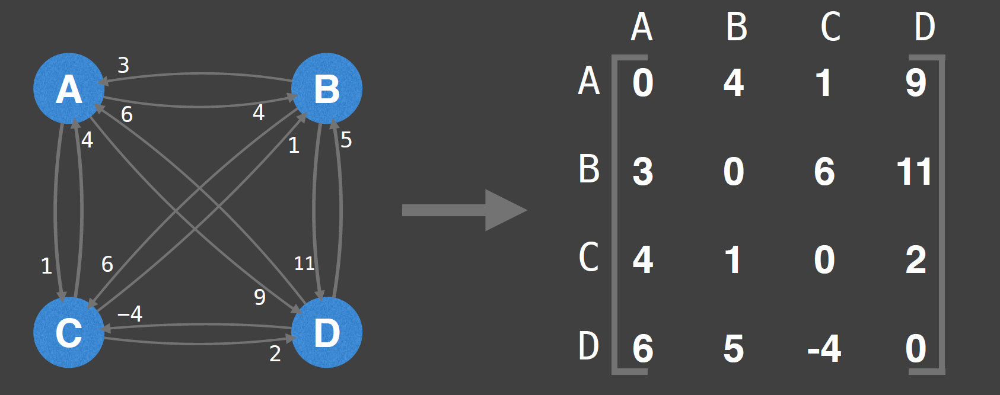
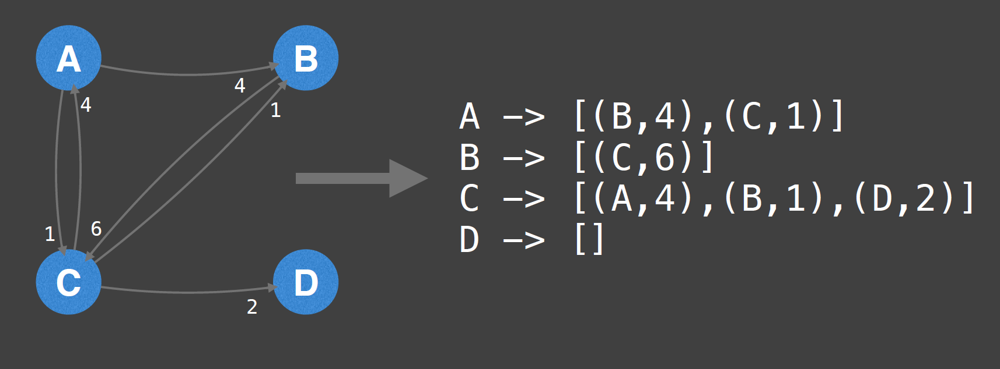
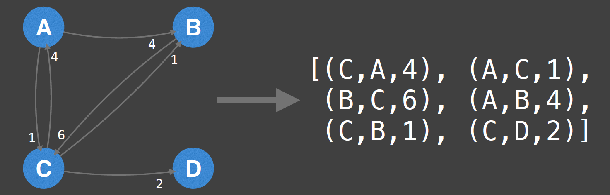

## Adjacency Matrix
A adjacency matrix m is a very simple way to represent a graph. The idea is that the cell m[i][j] represents the edge weight of going from node i to node j

NOTE: It is often assumed that the edge of going from a node to itself has a cost of zero.

| Pros | Cons | 
| -------- | -------- | 
| Space efficient for representing dense graphs | Requires Θ(V²) space |
Edge weight lookup is O(1) | Iterating over all edges takes Θ(V²) | time
Simplest graph representation

## Adjacency List
An adjacency list is a way to represent a graph as a map from nodes to lists of edges.

| Pros | Cons | 
| -------- | -------- | 
| Space efficient for representing sparse graphs | Less space efficient for denser graphs.
Iterating over all edges is efficient  | Edge weight lookup is O(E) 
| | Slightly more complex graph representation

## Edge List
An edge list is a way to represent a graph simply as an unordered list of edges. Assume the notation for any triplet (u,v,w) means:
“the cost from node u to node v is w”

This representation is seldomly used because of its lack of structure. However, it is conceptually simple and practical in a handful of algorithms.

| Pros | Cons | 
| -------- | -------- | 
| Space efficient for representing sparse graphs | Less space efficient for denser graphs.
Iterating over all edges is efficient | Edge weight lookup is O(E)
Very simple structure

