# Common Graph Theory Problems

[Shortest path problem](#shortest-path-problem)
[Connectivity](#connectivity)
[Negative cycles](#negative-cycles)
[Strongly Connected Components](#strongly-connected-components)
[Traveling Salesman Problem](#traveling-salesman-problem)
[Bridges](#bridges)
[Articulation points](#articulation-points)
[Minimum Spanning Tree](#minimum-spanning-tree)
[Network flow](#network-flow)

For the upcoming problems ask yourself:

- Is the graph directed or undirected?
- Are the edges of the graph weighted?
- Is the graph I will encounter likely to be sparse or dense with edges?
- Should I use an adjacency matrix, adjacency list, an edge list or other structure to represent the graph - efficiently?

## Shortest path problem
Given a weighted graph, find the shortest path of edges from node A to node B.

Algorithms: BFS (unweighted graph), Dijkstra’s, Bellman-Ford, Floyd-Warshall, A*, and many more.

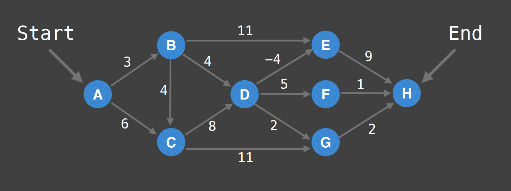
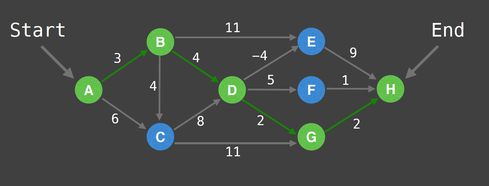

## Connectivity
Does there exist a path between node A and node B?
Typical solution: Use union find data structure or any search algorithm (e.g DFS).

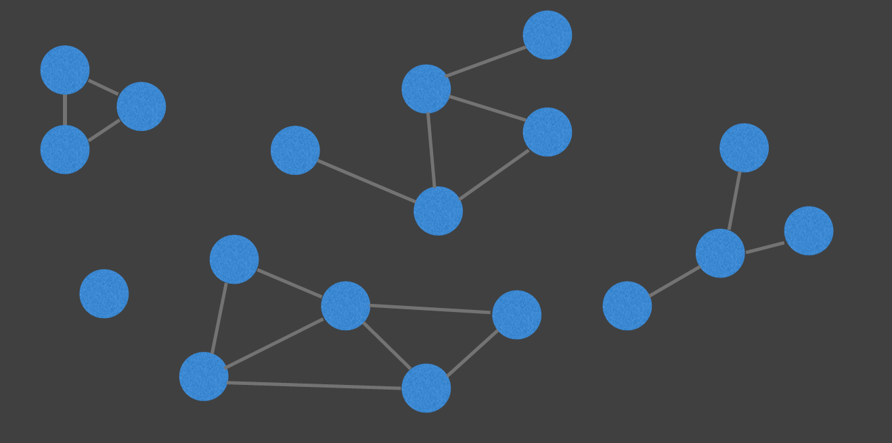
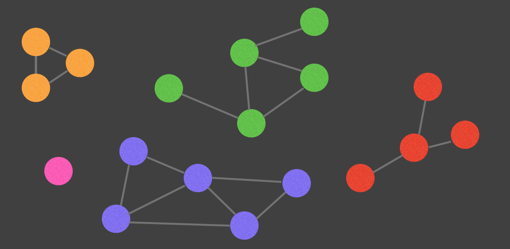

## Negative cycles
Does my weighted digraph have any negative cycles? If so, where?
Algorithms: Bellman-Ford and loyd-Warshall

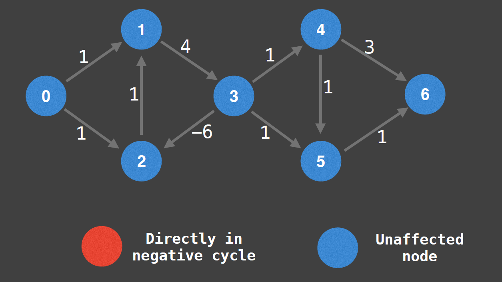
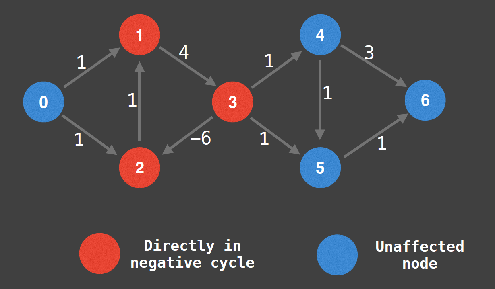

## Strongly Connected Components
Strongly Connected Components (SCCs) can be thought of as self-contained cycles within a directed graph where every vertex in a given cycle can reach every other vertex in the same cycle.
Algorithms: Tarjan’s and Kosaraju's algorithm

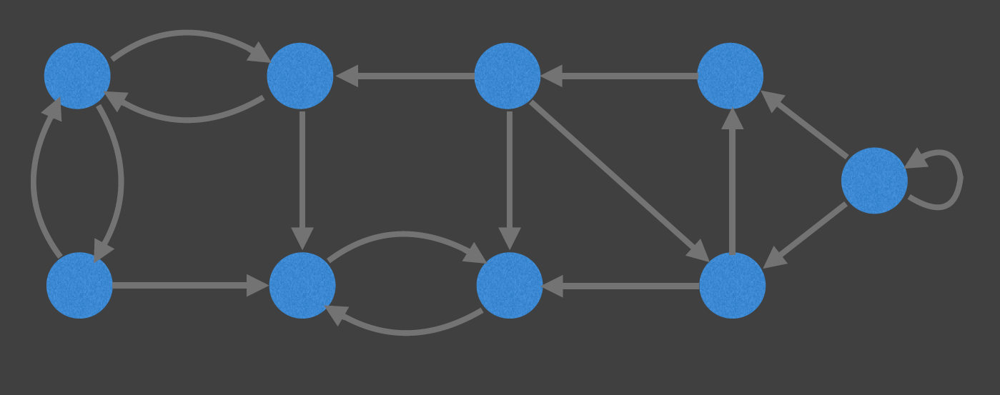
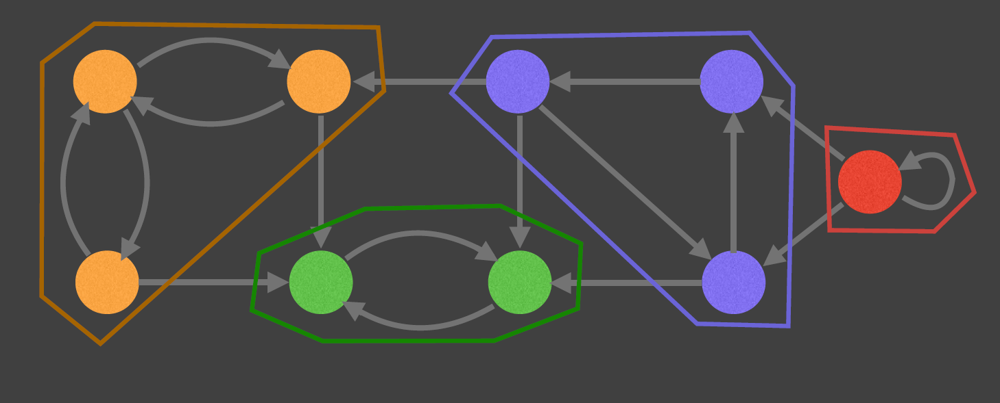

## Traveling Salesman Problem
"Given a list of cities and the distances between each pair of cities, what is the shortest possible route that visits each city exactly once and returns to the origin city?” - Wiki

The TSP problem is NP-Hard meaning it’s a very computationally challenging problem. This is unfortunate because the TSP has several very important applications.

Algorithms: Held-Karp, branch and bound and
many approximation algorithms

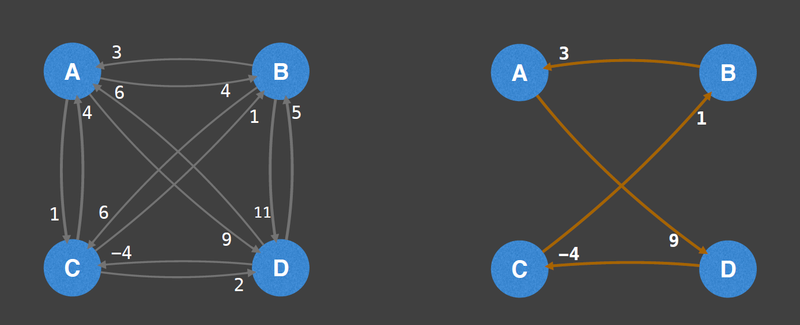

## Bridges
A bridge / cut edge is any edge in a graph whose removal increases the number of connected components.

Bridges are important in graph theory because they often hint at weak points, bottlenecks or vulnerabilities in a graph
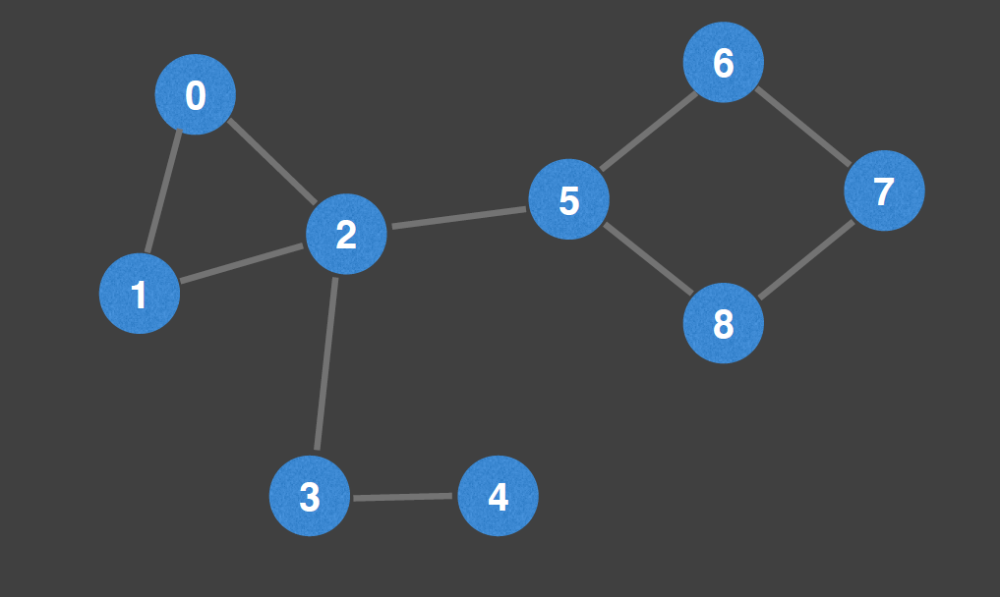
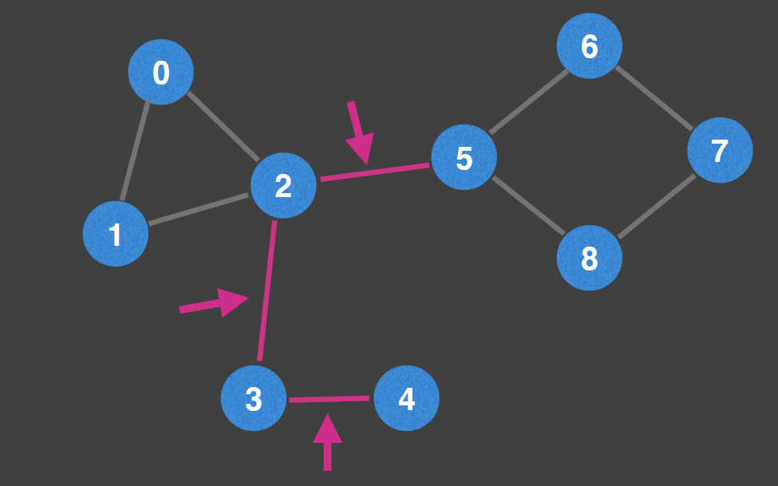

## Articulation points
An articulation point / cut vertex is any node in a graph whose removal increases the number of connected components.

Articulation points are important in graph theory because they often hint at weak points, bottlenecks or vulnerabilities in a graph.
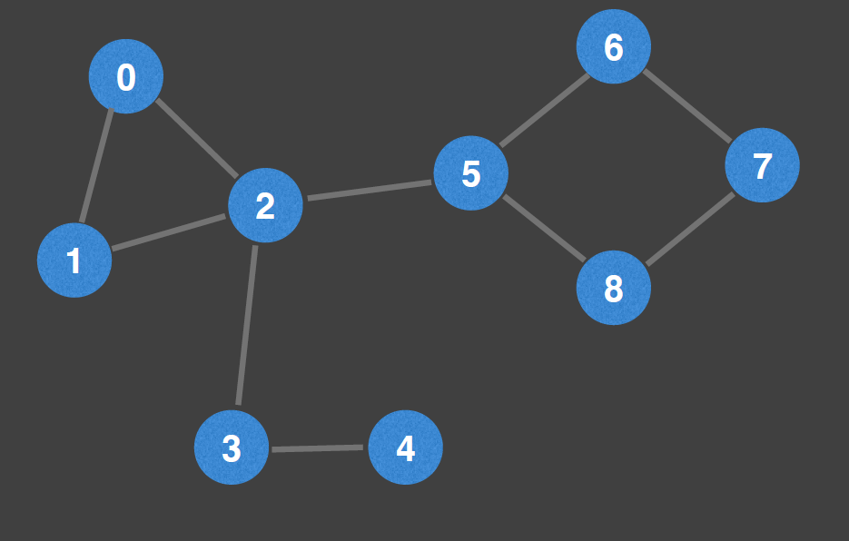
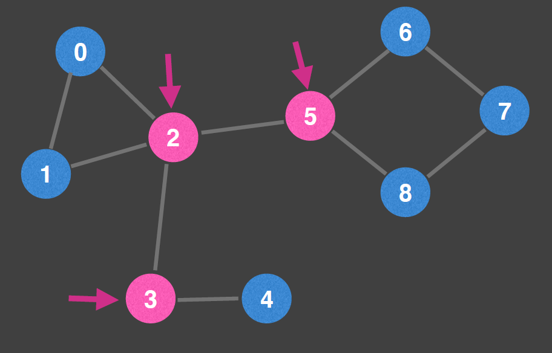

## Minimum Spanning Tree
A minimum spanning tree (MST) is a subset of the edges of a connected, edge-weighted graph that connects all the vertices together, without any cycles and with the minimum possible total edge weight. - Wiki

MSTs are seen in many applications including:
Designing a least cost network, circuit design, transportation networks, and etc…

Algorithms: Kruskal’s, Prim’s & Borůvka's algorithm

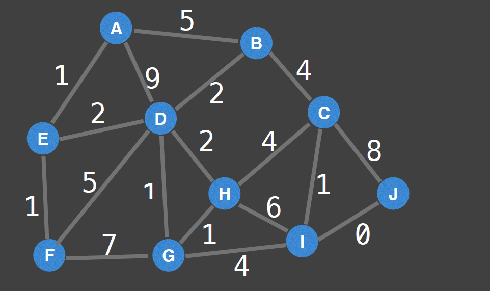
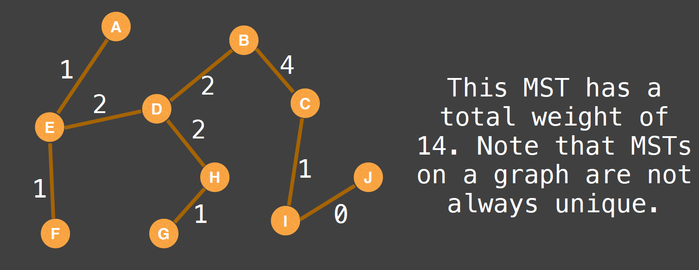

## Network flow 
Max flow
Q: With an infinite input source how much “flow” can we push through the network?

Suppose the edges are roads with cars, pipes with water or hallways with packed with people. Flow represents the volume of water allowed to flow through the pipes, the number of cars the roads can sustain in traffic and the maximum amount of people that can navigate through the hallways.

Algorithms: Ford-Fulkerson, Edmonds-Karp & Dinic’s algorithm

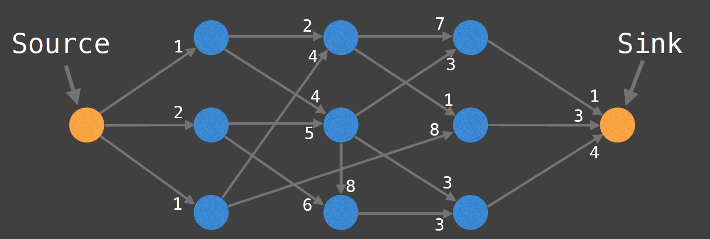